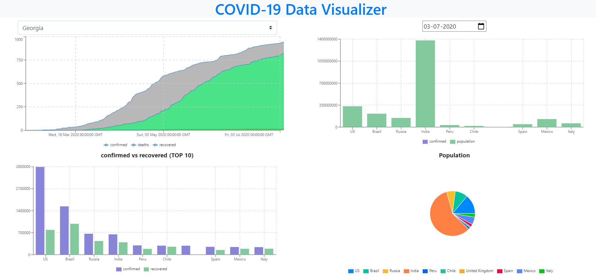

> This project was bootstrapped with [Create React App](https://github.com/facebook/create-react-app).

# COVID-19 Data Visualizer
This app lets you select the country of your choice and see the real time change in confimed,recovered and deaths. We can also see the TOP 10 worst effected bu clicking a particular date.

## How to Run the project
    1. `pip install -r requirements.txt`
    2. `npm install`

    3. python app.py
    4. npm run start

### Screenshot

